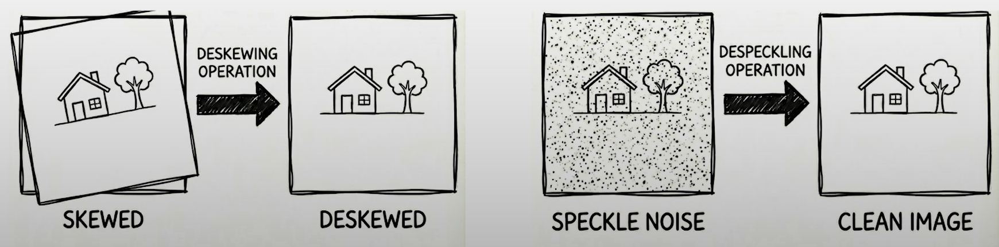
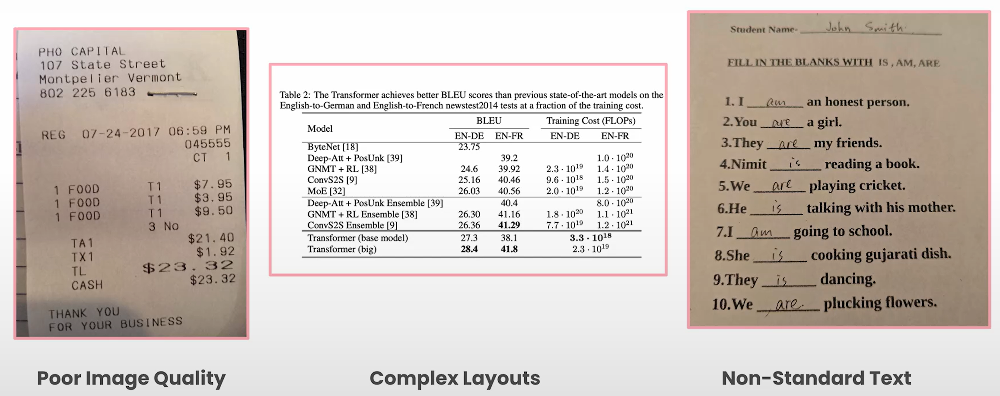
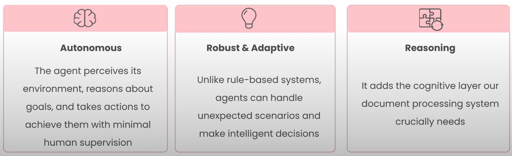
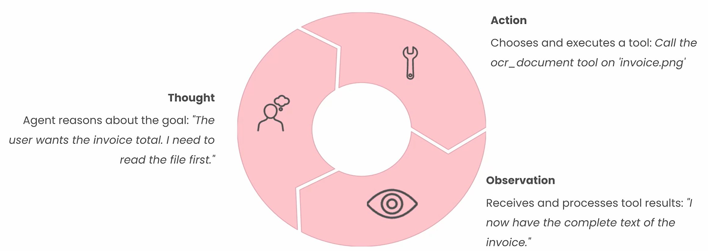

# Document Processing Basics

## Agenda

- [Document Processing](#document-processing)
  - Parsing, Extracting & Output formats
- [OCR](#what-is-optical-character-recognition-ocr)
  - Applications & Limitations
- [Agentic AI](#beyond-ocr-with-agentic-ai)
  - ReAct Loop

### Lesson Objectives

- Learn how to parse documents using OCR
- How to integrate OCR results into agentic workflows
- Build an agent to parse text from documents using OCR, and then extract information from the text using LLMs.
- Challenging cases
  - Handwriting
  - Tables
  - Scanned images

## Document Processing

- Bottom-up journey:
  - Pixels &#8594; Text &#8594; Structure &#8594; Reasoning

### Why is Document Processing important?

- Modern world is full of digital documents
  - Invoices, Receipts, Contracts and Reports
  - Stored as PDF, JPEG, PPT etc.
- Unstructured Format
  - Data meant for human eyes and not for machines
  - Implication: These documents can't be searched, analyzed or integrated into automated systems without manual intervention.
- Document processing is required to convert unstructured documents into structured machine-readable data.

### What is Document Processing?

- Refers to tools & techniques for converting unstructured data meant for human eyes into structured data (typically JSON or Markdown).
- These structured data can be searched, analyzed and integrated into automated systems.
- Important steps in document processing
  - Parsing
  - Extracting
- Parsing
  - More than just grabbing text
  - It must understand
    - What pieces of text actually mean
    - How they're related
    - How to organize them into predictable structure
  - Example: Invoice
    - We don't just want a blob of text
    - We want to extract vendor name, invoice date, total amount and line items
- Extracting
  - Assumption: Text is already machine-readable

### Data Formats for Parsing and Extracting

- Markdown
  - Lightweight formatting language
  - Preserves document hierarchy
    - Headings
    - Sections
    - Tables etc.
  - Both human-readable and LLM-friendly
  - Cost effective: Requires fewer tokens

- JSON (JavaScript Object Notation)
  - Structured data format using key-value pairs
  - Captures fields specified through a schema (e.g. invoice number, total amount)
  - Allows for metadata
    - Chunk types
    - Page numbers
    - Bounding box co-ordinates
    - Confidence scores etc.

## What is Optical Character Recognition (OCR)

- 2-step process
  - Step 1: Image Preprocessing
  - Step 2: Text Recognition

- Image Preprocessing
  - Deskewing
  - Despeckling

  

- Text Recognition
  - Advanced pattern matching compares image shapes against a comprehensive library of known characters.

- Limitations
  - Though OCR is good at reading clean docuemnts, it does not understand structure, meaning or relationships.
  - Think of OCR as eyes but not the brain.
  - Example: To find totals, extract tables, identify headings and classify documents; intelligence on top of OCR is required.

- Common OCR Failure Modes
  - Poor image quality
    - Blurry photos, shadows and noise
  - Complex layouts
    - Multi-column text, nested tables
  - Non-standard text
    - Handwriting, stamps, stylized fonts
  
  

### Document Processing vs Document Understanding

- Since OCR cannot understand the information extracted from the document, post-processing is important for **structure**, **recognition** and **relationships** in the text.
- Example: OCR does not know whether text belongs to a table or footnote.
- This lack of cognition is fulfilled by Agentic AI.

## Beyond OCR with Agentic AI

- Agentic AI bridges the gap between reading and understanding.
- It is the "brain" which must be added to the document processing system.
- An AI agent is an autonomous system that can
  - Perceive its environment
  - Reason about its goals
  - Take actions to achieve them with limited human supervision

    

  - In document processing
    - The agent reads the document via OCR if needed
    - Thinks about what the user asked
    - Chooses which tools to call
    - Iterates until it reaches the goal
  
  - Advantages
    - Rule-based pipelines can collapse on edge case
    - Whereas agents can reason through them
  
  - Components of Agentic Document systems
    - Brain (using an LLM)
      - Responsible for reasoning, planning and decision making
    - Eyes (OCR)
      - Converts visual content into text
    - Hands (tools)
      - APIs
      - Database lookups
      - File operations
      - Function calls
  
### ReAct framework

- ReAct: Reason + Act

  

- This loop gives agents
  - agency
  - adaptability
  - ability to correct mistakes
