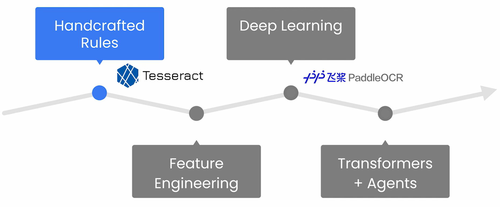
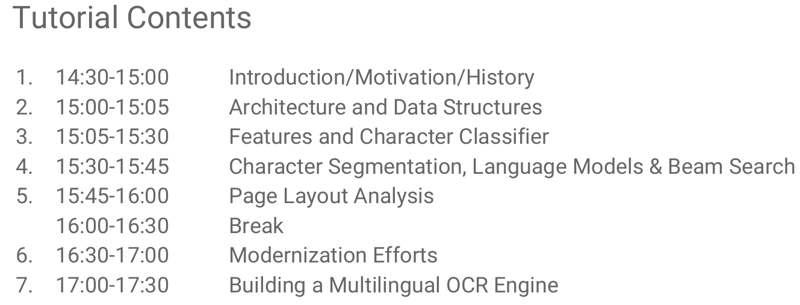
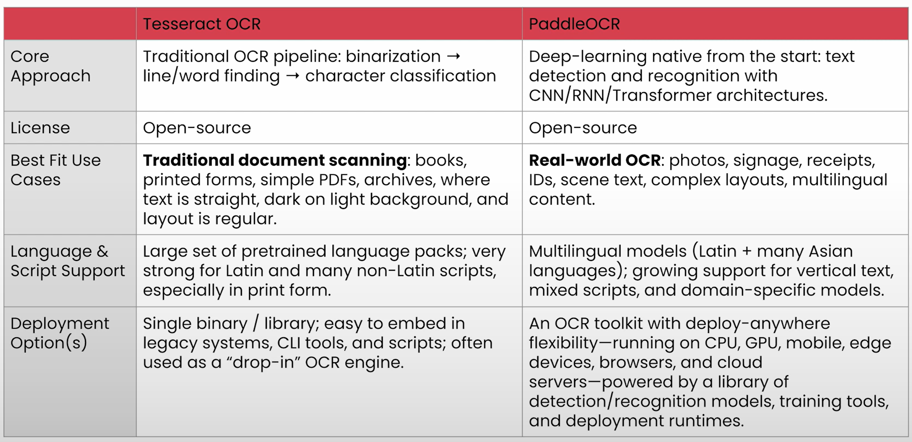

# Four Decades of OCR Evoulution

## Agenda

- [Tesseract](#tesseract-ocr-1980s---2010s)
  - Traditional OCR Model
- [PaddleOCR](#paddleocr-and-deep-learning-era-late-2010s---present)
  - Modern OCR Model
- Application & Limitations
  - Comparison of Models

## OCR Eras

- Evolution of Document Intelligence[1](#ref-doc_intelligence_evolution)
  
- Tesseract
  - Stands for the traditional, procedural Computer Vision approach
  - Lots of hand engineering, steps, rules
- PaddleOCR
  - Representative of the Deep Learning era
  - Uses neural network end-to-end for detection and recognition
- Shift from Tesseract style to PaddleOCR style systems
  - Mirrors the broader shift in AI
  - Carefully designed pipelines with handcrafted features &rarr; Data-driven trainable models that learn directly from examples

## Tesseract OCR (1980s - 2010s)

- Tesseract follows the **traditional approach**.
  - Relies on a rigid sequence of steps
    - Line finding
    - Word recognition
    - Character classification
- **Pros**
  - Extensive support for **100+ languages**.
  - Works well for clean, high-resolution printed documents.
  - Lightweight CPU-only
    - Deployable on resource-contrained systems.
- **Limitations**
  - Struggles with "text-in-the-wild" scenarios
    - Cannot reliably interpret handwriting or low-quality scans.
    - Performs poorly on complex or irregular layouts
      - Curved text
      - Multi-column documents
      - Noisy backgrounds
- Releases[2](#ref-Tesseract_releases)

### Tutorials & Publications

- Publication: An overview of Tesseract OCR Engine[3](#ref-overview_Tesseract_OCR_Engine)
- Tutorial slide deck by Ray Smith at Document Analysis Systems (2016)[4](#ref-Tesseract_tutorial_DAS_2016)
  

## PaddleOCR and Deep Learning Era (Late 2010s - Present)

- Circa 2015, two-stage pipeline using deep learning becomes new OCR standard
  - **Text Detection Model**
    - Find the regions that contain text
  - **Text Recognition Model**
    - Read the content of each text region

- PaddleOCR[5](#ref-PaddleOCR_Technical_Report)
  - Developed by Baidu in 2020
  - Open-source deep learning OCR system
  - Components and algorithms
    - **Text Detection Model**
      - DBNet (Differentiable Binarization Network)
    - **Text Recognition Model**
      - SVTR (current)
      - SRN (former)
      - CRNN (earliest)
  - Pros
    - Reasonably **accurate** on complex, irregular and curved text.
    - More **efficient** when accelerated by GPUs
    - Offers lighter weight options designed for deployment on **mobile and edge** devices.

- Tesseract vs PaddleOCR
  

## References

1. [Evolution of Document Intelligence](https://landing.ai/blog/ocr-to-agentic-document-extraction-a-look-into-the-evolution-of-document-intelligence)  
2. [Tesseract Releases](https://tesseract-ocr.github.io/tessdoc/ReleaseNotes.html)  
3. [An Overview of the Tesseract OCR Engine by Ray Smith (2017)](https://static.googleusercontent.com/media/research.google.com/en//pubs/archive/33418.pdf)  
4. [Tesseract tutorial at DAS 2016](https://tesseract-ocr.github.io/docs/)  
5. [PaddleOCR 3.0 Technical Report](https://arxiv.org/pdf/2507.05595)  
