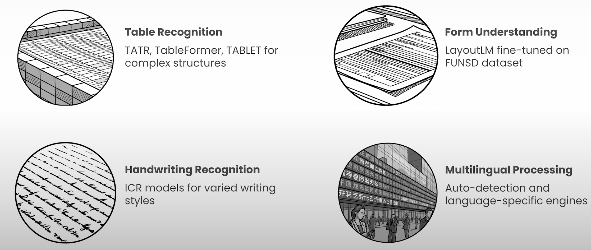
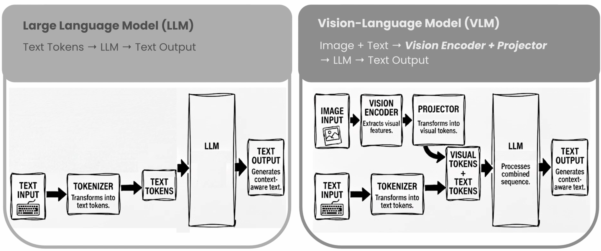
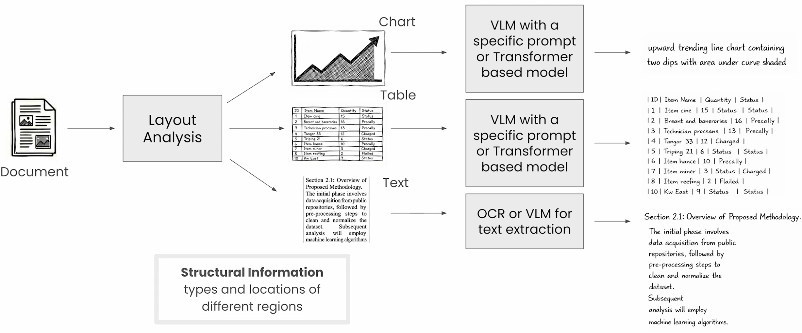
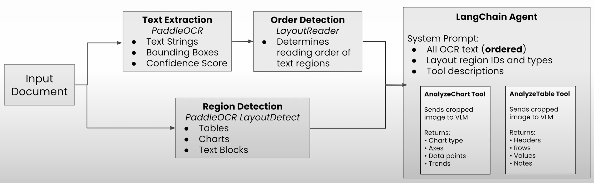

# Layout Detection and Reading Order

## Agenda

- [Foundation](#foundation)
  - Layout detection & critical importance
- Core Techniques
  - Reading order detection and sequential understanding
- Real-World Challenges
  - Forms, tables, figures, handwriting, and multilingual docs
- [Vision-Language Models](#what-is-a-vision-language-model)
  - Multi-Modal LLMs and reasoning
- [Hybrid Approach](#hybrid-approach-to-document-understanding)
  - PaddleOCR + LayoutReader[1](#ref-LayoutReader) + VLM

## Foundation

### Limitations in Traditional Pipelines

- Traditional Pipeline
  - Stage 1
    - OCR converts 2D document &rarr; 1D text string
    - Treats page as a linear sequence of characters
  - Stage 2
    - LLM attempts to analyze this unstructured output
- Limitation with this pipeline
  - Doesn't have enough context to reason correctly
- Complex documents
  - Financial reports
  - Research papers
  - Legal contracts

### What is Layout Detection?

- Layout detection
  - Process of **identifying and labeling regions** in document images
    - Text blocks
      - Title
      - Footnote
      - Caption
      - Body text
  - Alternative name: **Document Layout Analysis**
- Answers
  - "Where": Geometric Layout
  - "What": Logical Layout

### Importance of Layout Detection

- Avoiding "Text Soup"
- Preserving Meaning
- Accurate Extraction
- Efficiency & Precision
  - Real world documents include segments:
    - columns, tables, charts, images, captions, headers, footers, stamps and annotations
  - When these components are explicitly detected and labelled
    - Downstream models know what kind of information they're looking at before they try to reason over them.

### Determining the Reading Order

- Layout Detection
  - Provides the contextual glue that prevents document meaning from being lost.
- Reading Order Detection
  - Process of determining the correct sequence for text blocks.
  - Crucial for complex layouts where spatial arrangement conveys semantic relationships.

### Evolution of Reading Order Detection

- Handcrafted Rules Era
  - Simple co-ordinate sorting algorithms like X-Y cut
  - Limitations
    - Fail on complex layouts
      - Irregular column structure
      - Nested elements
      - Non-standard reading flows
- Deep Learning Era
  - LayoutReader: Revolutionized the field by predicting correct sequence using the **ReadingBank dataset**

### LayoutReader

- Model developed by Microsoft for detection of reading order.
- Architecture:
  - Sequence-to-sequence (seq2seq) architecture
  - LayoutLM model as its encoder
- Purpose
  - To predict the correct reading order of words or text lines in a document.
- Process
  - Takes in OCR-produced bounding boxes (e.g. PaddleOCR)
  - Rearranges the document's token sequence to reconstruct a human-readable reading order.

### Why OCR + Reading Order is Not Enough

- OCR only captures text.
- It misses visual information, images, charts, diagrams, spatial relationships, and visual context.

### Key Parsing Challenges to OCR

- Understanding Forms
- Handwritten Text
- Multilingual Scripts
- Complex Tables
- Complex Figures & Graphics

### Understanding Forms

- Core Challenge
  - Key-value pairs: Correctly associating field labels with input values, especially when non-adjacent
- Template-Based Extraction
  - Works for known layouts
- Flexible Key-Value detection
  - Rules or ML: Works based on proximity and content
- Fine-tuned Transformers
  - LayoutLM trained on form datasets (FUNSD[2](#ref-FUNSD)) learns relationships automatically
- Non-text elements
  - Computer vision required to detect checkbox states (checked/unchecked)

### Table Structure Recognition

- Challenge
  - Traditional OCR loses ordering from tables by flattening row-column relationships
  - Convert table into usable formats (CSV, JSON, HTML/Markdown) capturing these relationships
- State-of-the-Art Models
  - Table Transformer (TATR)
  - TableFormer
  - TABLET

### Handwritten, Multilingual Documents

- Handwritten Text
  - Intelligent Character Recognition (ICR)
    - Trained on handwritten datasets
    - Deep Learning approaches (CNN + RNN)
    - Sequence Modeling for cursive text
- Multilingual Content
  - Challenges
    - Non-standard characters
    - Unique fonts
    - Different reading orders
      - Right-to-left (Arabic)
      - Vertical text (some East Asian languages)

### Paradigm Change

- Earlier multiple specialized models were required for various use cases
  
- Vision Language Models (VLMs): Shift from specialized tools to general purpose intelligence

## What is a Vision-Language Model?

- Historically: Computer Vision and NLP evolved as separate disciplines.
- VLMs
  - Unified architecture connecting visual concepts to linguistic meaning.
  - Process images and text simultaneously, creating unified uderstanding across modalities.
  - True Reasoning
    - Machines understand context, relationships, and intent within visual scenes.

### How VLMs differ from LLMs

- LLMs vs VLMs
  
- VLM components
  - Vision Encoder
    - Converts pixels into numberical vectors
    - Models: CLIP, SigLIP
  - Projector
    - Translation layer (MLP or Q-Former) converts visual vectors into word embeddings
  - LLM
    - Standard transformer processes combined visual and text tokens
- VLM performance on understanding document depends on performance of
  - Structure
  - Layout detection
  - Reading order

### Why VLM alone is not enough

- Generic VLMs struggle with **Visually Rich Document Understanding (VRDU)**
- Hallucinate when visual cues are missing or ambiguous.
- Lack deterministic grounding to actual pixel location.
- Struggle with nested layouts, or multi-page structure.
- Documents get resized to fit model input dimensions
  - Makes small text unreadable and fine details lost.

## Hybrid Approach to Document Understanding

- Combine
  - Layout detection: Provides deterministic grounding
  - VLMs: Handle the elements that benefit from visual reasoning
  
- Implementation:
  - Orchestrate this workflow through an agentic framework
    

## References

1. [LayoutReader](https://github.com/FreeOCR-AI/layoutreader)  
2. [FUNSD](https://guillaumejaume.github.io/FUNSD/)
