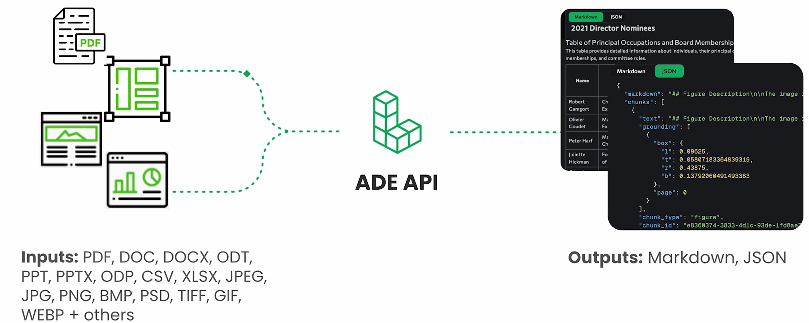
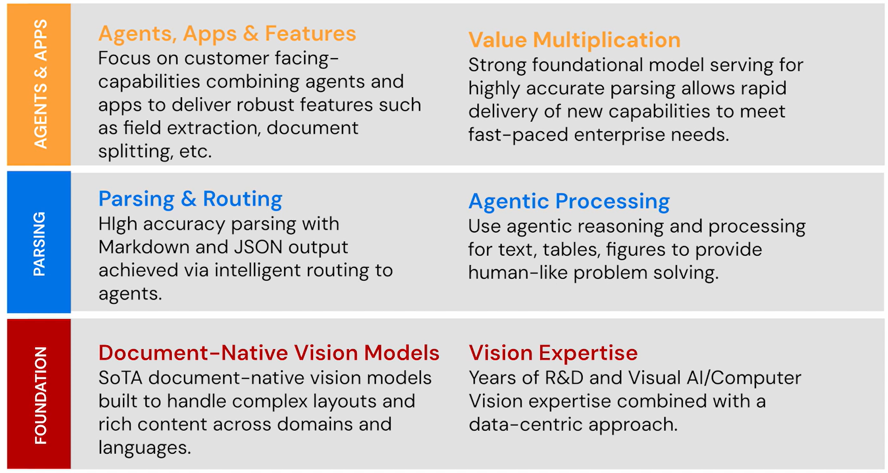

# A Single API for Agentic Document Understanding

## Agenda

- [What is Agentic Document Extraction](#agentic-document-extraction)
  - Overview
- [Common Use Cases](#use-cases)
  - Field Extraction & RAG
- [The Technology](#three-pillars-of-ade)
  - Key differentiators
- Benchmark Performance
  - DocVQA leaderboard
- How to Use it
  - Understanding the API

## Agentic Document Extraction

## Use Cases

### Key-Value Pairs Extraction from Documents

- **Accurately extract** specific information from a variety of document formats
- **Verifiably trace** the values back to their respective sources

### AI Assistants for Complex Documents

- To prepare documents for Retrieval Augmented Generation (RAG), users must understand information from **tables, forms and charts** with reference to their sources for **data validation**.

## Three Pillars of ADE

- Vision-First
  - Treat documents as visual objects
  - Meaning is encoded in layout, structure, and spatial relationships
- Data-Centric
  - Train on the highest quality, curated data
  - Right data is as important as the right model architecture
- Agentic
  - Deliver systems that plan, decide, act and verify outputs until the response meets quality standards

### Build with Vision - Build on Vision

- Document Pre-trained Transformer (DPT) models are documented at Landing AI's docs[1](#ref-DPT_docs).

## DocVQA Benchmark

- DocVQA: A benchmark dataset designed to evaluate machine-reading systems on **real-word document images**.[2](#ref-DocVQA)
- Tests model ability to understand text and layout through **question-answering tasks**.
- Documents source: UCSF Industry Documents library

## References

1. [Document Pre-trained Transformer](https://docs.landing.ai/ade/ade-parse-models)  
2. [DocVQA (HuggingFace)](https://huggingface.co/datasets/lmms-lab/DocVQA)
